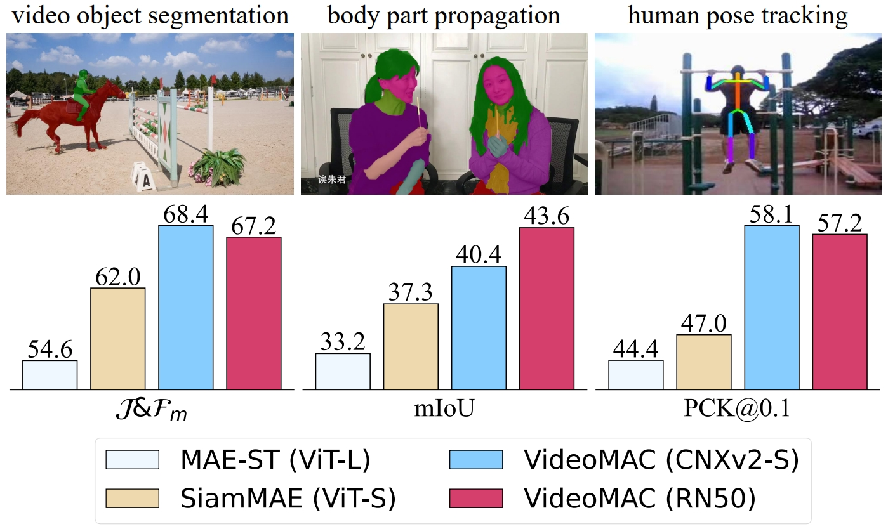

## VideoMAC: **V**ideo **M**asked **A**utoencoders Meet **C**onvNets

## Abstract
>Recently, the advancement of self-supervised learning techniques, like masked autoencoders (MAE), has greatly influenced visual representation learning for images and videos.
Nevertheless, it is worth noting that the predominant approaches in existing masked image / video modeling rely excessively on resource-intensive vision transformers (ViTs) as the feature encoder. In this paper, we propose a new approach termed as **VideoMAC**, which combines video masked autoencoders with resource-friendly ConvNets. Specifically, VideoMAC employs symmetric masking on randomly sampled pairs of video frames. To prevent the issue of mask pattern dissipation, we utilize ConvNets which are implemented with sparse convolutional operators as encoders. Simultaneously, we present a simple yet effective masked video modeling (MVM) approach, a dual encoder architecture comprising an online encoder and an exponential moving average target encoder, aimed to facilitate inter-frame reconstruction consistency in videos. Additionally, we demonstrate that VideoMAC, empowering classical (ResNet) / modern (ConvNeXt) convolutional encoders to harness the benefits of MVM, outperforms ViT-based approaches on downstream tasks, including video object segmentation (+**5.2%** / **6.4%** J&F), body part propagation (+**6.3%** / **3.1%** mIoU), and human pose tracking (+**10.2%** / **11.1%** PCK@0.1).


|  |  |
| :---------------------------: | :-----------------------------: |
|         Comparison            |            Pipeline             |


>An illustration of VideoMAC for ConvNet-based MVM. During pre-training, we mask 75% of symmetric patches from two frames randomly. In our VideoMAC, the MVM of frame pairs is achieved by an online network optimized by gradients (, online loss 
) and a target network updated by EMA (, target loss 
). 
 is computed as the reconstruction consistency loss between reconstructed patches of frame pairs.

## Quantitative Results


## Qualitative Results
|  |
| :-------------------------: |
| Visualization of frame reconstruction and video object segmentation on DAVIS. |

|  |
| :-----------------------: |
| Visualization of frame reconstruction and body part propagation on VIP. |


|  |
| :------------------------: |
| Visualization of frame reconstruction and human pose tracking on JHMDB. |

## Acknowledgement
This repository borrows from [CNXv2](https://github.com/facebookresearch/ConvNeXt-V2), [MAE](https://github.com/facebookresearch/mae) and [MinkowskiEngine](https://github.com/NVIDIA/MinkowskiEngine).

## Citation
```
@inproceedings{pei2024videomac,
  title={VideoMAC: Video Masked Autoencoders Meet ConvNets},
  author={Pei, Gensheng and Chen, Tao and Jiang, Xiruo and Liu, Huafeng and Sun, Zeren and Yao, Yazhou},
  booktitle={CVPR},
  year={2024}
}
```
